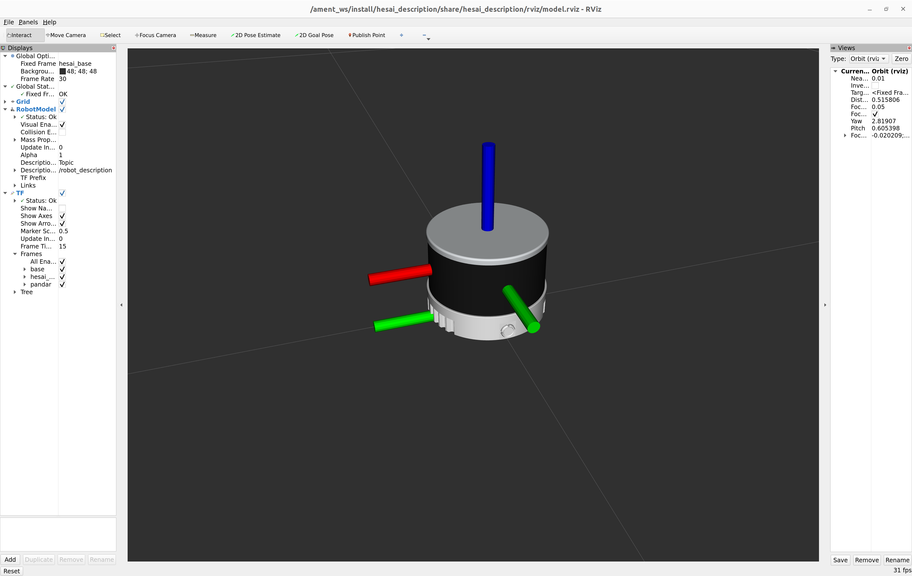

# hesai_description




This package contains a **URDF Xacro description of the Hesai XT32 and QT64 lidars**. In simulation the Gazebo Velodyne plug-in is used. The meshes were obtained from the original CAD provided by Hesai.

This repository is not associated to or maintained by Hesai.


For visualizing the URDF with RViz launch:

```bash
$ ros2 launch hesai_description visualize.launch.py
```

